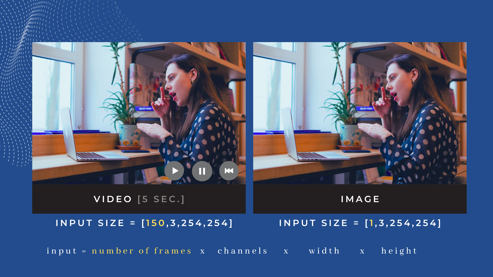
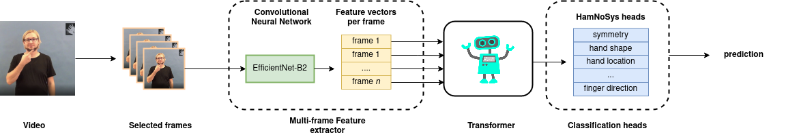

# Model Sign Language with Machine Learning
That's our goal from the beginning. But how can we model Sign Language? It is a subtle mix of pose estimation, continuous movement, event detection, and natural language processing challenges. From the machine point of view, our task is formidable.

## The challenge
We have a series of video frames sampled according to the recorded FPS (frames-per-second). Examining only a single frame would be already a difficult task; but somewhat acceptable. We are used to the typical image processing challenges, like light, position, or quality variations. But here we have videos.

Hence to recognize specific actions, we need to analyze a whole sequence of images instead. A series of frames will create glosses -- a single gesture, similar to a word for us.

> Gloss is an annotation system that applies a label (a word) to the sign. Number glosses depend on a language and dataset. It is usually a higher number as it must define as many words (glosses) as possible.

Finally, a sequence of glosses will create a sentence. But translating it one-to-one might still be not enough. Sign Languages often have entirely different grammar than spoken language. For instance, Polish Sign Langauge has completely different grammar than Polish.

> Dziecko płakało w dzień i w nocy.
> (Child was crying all day and night.)

But gloss translation will result in:

> Dziecko płakało cały noc dzień i noc. (Child cry whole night day and night)

where most words are not lemmatized and without the correct tense.



## Approach it like a language

However, we already know how to deal with languages. This is nothing more than  ASR -- Automatic ~~Speech~~ Sign Recognition System and Natural Language Processing task.
Instead of a voice, we analyze the videos. Instead of words, we have letters. Easy, huh?

A common and successful approach to Sign Language Recognition uses the **Transformers** model and selected **Feature Extractor**: Graph Convolutional Networks or CNNs.


# Pipeline prototype
Inspired by the SOTA, we prepared a proposition of our pipeline.

## Everything starts with data
As mentioned earlier, our input is a video. Preprocessing the whole video is not exactly the fastest solution hence instead, we use only the selected video frames. A sequence of video frames is then passed to the **feature extractor**.

Its job is to find the most relevant information in a single frame and pass it to the **transformer**. A transformer will analyze the sequence of representations and extract new information from the context. The new enhanced, context-aware representation will be passed to a classification head, which will guess what kind of a gloss it is.

`Video --> Frames --> Feature extractor --> Transformer --> Classification heads --> Prediction for video`





Let's look closer at each part of the model!


## § Feature extractors
A feature extractor is a model used to extract features directly from the input: e.g., a set of video frames. For instance, we use a CNN that extracts features from each video frame with `multi_frame_feature_extractor`. Another approach could be extracting the pose of a signer and passing the coordinates to GCN (Graph CNN), for each frame separately.
Feature extractor returns a representation feature vector for every frame.

## §  Transformer
The transformer is a widely-used deep learning model that adopts the mechanism of self-attention, differentially weighting the significance of each part of the input data. It is used primarily in natural language processing (NLP). The Transfomer model will get representation from feature_extractor of size `num_frames,representation_size` for each video in our pipeline.

## § Classification heads
Pipeline handles multi-head classification. We predefine `classification_heads` for both Gloss Translation and HamNoSys recognition. Our `classification_heads` are defined in our repository code.


```python
hamnosys_heads = {
            "symmetry_operator": 9,
            "hand_shape_base_form": 12,
            "hand_shape_thumb_position": 4,
            "hand_shape_bending": 6,
            "hand_position_finger_direction": 18,
            "hand_position_palm_orientation": 8,
            "hand_location_x": 5,
            "hand_location_y": 37,
        }  # number of classes for each head

gloss_head = {"gloss": 2400}  # number of classes for each head
```

Hamburg Sign Language Notation System (HamNoSys) is a gesture transcription alphabetic system that describes the symbols and gestures such as hand shape, hand location, and movement. Read more about HamNoSys [here - Introduction to HamNoSys](https://www.hearai.pl/post/4-hamnosys/) and [here - Introduction to HamNoSys Part 2](https://www.hearai.pl/post/5-hamnosys2/). HamNoSys always have the same number of possible classes.

# The Sign Language Model

We use [pytorch lightning](https://www.pytorchlightning.ai/) to implement our models, as it gives excellent flexibility while reliving us from writing training and validation loops. It's as simple as that!


You can take a look at a full model [here](https://github.com/hearai/hearai/blob/main/models/model.py).
```python
class GlossTranslationModel(pl.LightningModule):
    """Awesome model for Gloss Translation"""

    def __init__(self):
        super().__init__()

        # models-parts
        self.model_loader = ModelLoader()
        self.feature_extractor = self.model_loader.load_feature_extractor()

        # use same feature extractor for every frame
        self.multi_frame_feature_extractor = MultiFrameFeatureExtractor(
            self.feature_extractor
        )
        self.transformer = self.model_loader.load_transformer()

        # dynamically make as many heads as required
        self.cls_head = list()
        print(self.num_classes_dict)
        for value in self.num_classes_dict.values():
            self.cls_head.append(nn.Linear(transformer_output_size, value))

    def forward(self, input, **kwargs):
        predictions = list()
        x = self.multi_frame_feature_extractor(input)
        x = self.transformer(x)
        for head in self.cls_head:
            predictions.append(head(x.cpu()))
        return predictions
```

# Repository

Want to try it out? Check out the repository here: [github.com/hearai/hearai](https://github.com/hearai/hearai)
***But careful! It's still in progress.***

