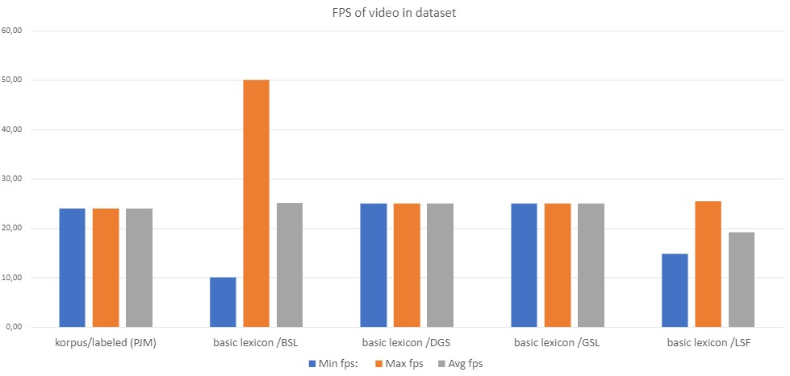
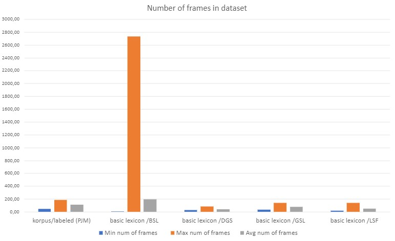

Deep learning depends strongly on data. It is the crucial aspect of the training of any model. Let's be clear - without (preferably high quality) data there is no point in doing machine learning (ML).

Our task - Sign Language (SL) Processing - requires the use of videos. 

Most of the SL datasets are at most a couple of hours long (summing up the duration of all videos). Unfortunately while working on (kind of) Natural Language Processing tasks we need hundreds of hours of the recordings to make our training efficient. Therefore, the first difficulty in our project was to find and download various kinds of SL datasets. We searched for any types of datasets, with and without HamNoSys annotation. During our work we made a list of found datasets with their characteristics, which are listed [here]([https://github.com/hearai/sign-language-review](https://github.com/hearai/sign-language-review)). 

## Data collection process

### I found the dataset on the internet - what’s next?

Unfortunately, not every dataset is ready to download with one click. Firstly, check the license under which the data is uploaded. Most organizations share their work only for research purposes.

Many websites are dictionaries. Every word occurs just once, sometimes there is additional information e.g. list of synonyms or example of use.

Our research is language independent (more on our approach and pipeline [here](https://www.hearai.pl/post/10-pipeline/)) - which means that we can use datasets of various Sign Languages - but as you can see in the bellow plot - most of the available datasets  contain American (ASL), German (DGS), Greek (GSL) and Polish (PJM) Sign Language. 

| Language |	Time |	Num of videos |	
| ------------- |:-------------:| -----:|
| ASL |	60:19:00 | 42196 |			
| BSL	| 9:17:00 |	6776	|		
| DGS |	81:56:03 |	46411	|		
| GSL |	0:32:00	| 2835	|	
| LIS |	1:26:00	| 1480	|
| LSF	| 0:25:00	| 1045	|
| PJM	| 27:37:00 |	16072	|	
| TSL |	24:25:00 | 37655	|	
| VGT |	7:54:26 |	10497	|	

## Data characteristics

Found databases are pretty different, which is reflected not only in the operated SL, but also different video sizes, backgrounds, and even number of signers. Diversity of the datasets prevents overfitting but sometimes makes training difficult.

In this particular case, we tried to extract samples consisting of 3 views (front, side, up). Many databases contain videos extracted from YouTube, with subtitles or logos.These videos need special care to make them useful.

Another problem is the quality of videos and their length. There are signs that can be  performed in fractions of seconds, but also mistakes are made and whole sentences are flashed instead of separate glosses. In some cases we have faced the problem of unavailable/non-existing or unreadable files. 

### Statistics 

To have a clear perspective of what the data is despite actually watching these videos (which was a huge part and cannot be underestimated)  we made statistics regarding datasets currently used for our research. 

|                           |  korpus/labeled (PJM) |  basic lexicon /BSL |  basic lexicon /DGS |  basic lexicon /GSL |  basic lexicon /LSF |
| ------------------------- | --------------------- | ------------------- | ------------------- | ------------------- | ------------------- |
| Min num of frames         | 44,00                 | 1,00                | 29,00               | 36,00               | 17,00               |
| Max num of frames         | 187,00                | 2730,00             | 82,00               | 138,00              | 139,00              |
| Avg num of frames         | 110,00                | 195,00              | 42,00               | 78,00               | 53,00               |
| Min duration in seconds   | 1,83                  | 0,10                | 1,16                | 1,44                | 1,13                |
| Max duration in seconds   | 7,79                  | 109,20              | 3,28                | 5,52                | 5,56                |
| Avg duration in seconds   | 4,59                  | 7,62                | 1,68                | 3,12                | 2,66                |
| Min fps                  | 24,00                 | 10,00               | 25,00               | 25,00               | 14,90               |
| Max fps                   | 24,00                 | 50,00               | 25,00               | 25,00               | 25,48               |
| Avg fps                   | 24,00                 | 25,18               | 25,00               | 25,00               | 19,16               |
| Min frame height          | 1280,00               | 320,00              | 320,00              | 320,00              | 320,00              |
| Max frame height          | 1280,00               | 481,00              | 320,00              | 320,00              | 320,00              |
| Avg frame height          | 1280,00               | 320,16              | 320,00              | 320,00              | 320,00              |
| Min frame width           | 720,00                | 240,00              | 180,00              | 240,00              | 240,00              |
| Max frame width           | 20,00                 | 361,00              | 180,00              | 240,00              | 240,00              |
| Avg frame width           | 720,00                | 240,12              | 180,00              | 240,00              | 240,00              |
| Num of nonreadeable files | 3,00                  | 0,00                | 0,00                | 0,00                | 0,00                |

### Annotations

We can divide sign language into two levels - isolated and continuous. Video with _isolated_ type of language contains recording of one word (gloss). _Continuous_ means  that we have the whole sentence or even broader story recorded. 

Moving on to annotations, SL datasets are annotated in many different ways but the most popular ones are: 

* gloss annotations
* HamNoSys
* SignWriting

Our project aims to translate SL into HamNoSys notation so we chose isolated sign language as it is common for the datasets to have HamNoSys annotations for glosses only. 

HamNoSys (The Hamburg Notation System) has already been described in or previous posts,  we encourage you to read about it  [here](https://www.hearai.pl/post/4-hamnosys/)  and [here]([https://www.hearai.pl/post/5-hamnosys2/](https://www.hearai.pl/post/5-hamnosys2/)) .

For our research we went for datasets with HamNoSys and gloss annotations.

## Data preprocessing

While  working with data from many sources you need to be careful and consistent in making them unified.

The process we came up with  contains few steps:
 
* Preparing custom annotation file for every dataset
* Excluding unreadable files
* Changing video formats and editing 
* Making statistics 
* Generating pose landmarks
* Cutting video into frames 

In our approach we create a separate annotation file and dictionary for each dataset. In the dictionary, a number is assigned to every gloss as numbers are expected by the model input. Annotation file is a  .txt file. 
For each video in dataset it has 6 columns:

* Video file name
* Number of the starting frame
* Number of the ending frame
* Nr of gloss in the dictionary
* Gloss annotation
* HamNoSys annotation (if known)
* Other values (synonyms, regions of usage etc)

**To sum up:**

1. Most of the available datasets  contain American (ASL), German (DGS), Greek (GSL) and Polish (PJM) Sign Language.
2. Video datasets are diverse in terms of number of signers, size of files, backgrounds.
3. We divide SL into two levels - isolated and continuous.
4. Commonly used annotations in SL databases are gloss and HamNoSys.
