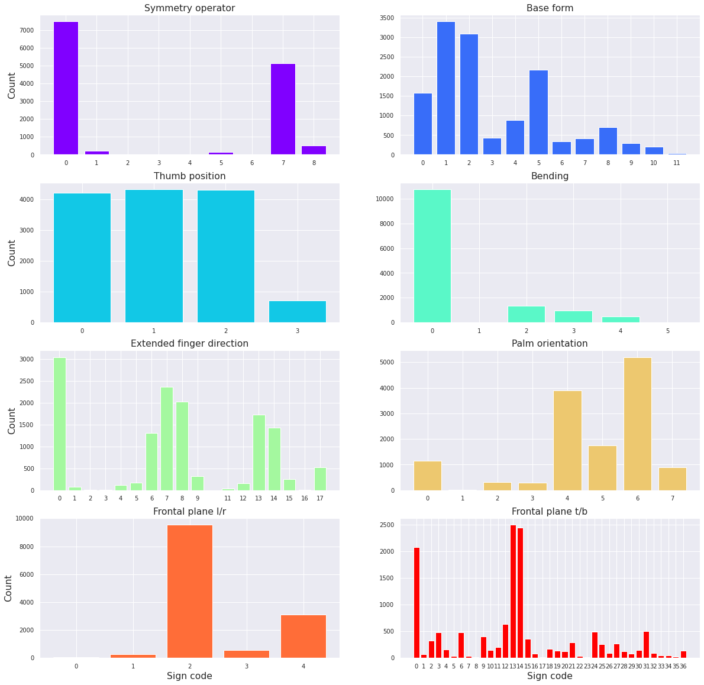
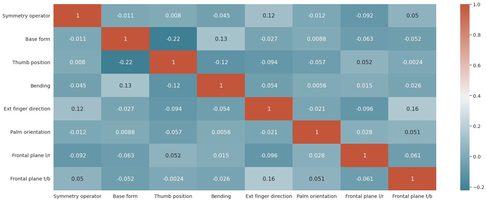

In our [previous post](https://www.hearai.pl/post/11-dataset/) we told you a story about collecting, and preprocessing sign language datasets. Now it is time to delve deeper into the understanding of the datasets used, which is exploratory data analysis, in short EDA.

# Source datasets

Out of all available datasets, we chose five with The Hamburg Notation System (HamNoSys) annotations. As our work still revolves around this notation system, we have already prepared some posts about it, you can find them [here](https://www.hearai.pl/post/4-hamnosys/) and [here](https://www.hearai.pl/post/5-hamnosys2/).

We ended up with a list of datasets, which in total consists of 9.5h and 10k glosses, as presented in Table 1. Our list contains the datasets as:

* [PJM corpus](https://www.slownikpjm.uw.edu.pl/en) - a collection of video data from 2 signers of Polish Sign Language (PJM) with resolution 1280x720px, taken frontal on plain background.
* [basic lexicon](https://www.sign-lang.uni-hamburg.de/dicta-sign/portal/concepts/concepts_eng.html) -  multilingual corpus of the four SLs BSL (British), DGS (German), GSL (Greek) and LSF (French) covering the topic of European travel with resolution 320x240px, taken mainly in front on plain background.
* [GaLex](https://www.sign-lang.uni-hamburg.de/galex/intro/vorwort.html#nav1) -  a corpus-based dictionary of DGS for technical terms from the field of landscaping and horticulture with resolution 160x90px.
* [GLex](https://www.sign-lang.uni-hamburg.de/glex/intro/vorwort.html#nav1) -  a corpus-based dictionary of DGS for technical terms from the field of health and nursing care with resolution 108x80px.
* [GSL dataset](https://vcl.iti.gr/dataset/gsl/) - a large-scale RGB+D dataset divided into isolated gloses of GSL and saved as frames (separate images) with resolution 1440x1080px.

  
<table style=""><thead><tr><th><em>Language</em></th><th style="text-align:center">Time</th><th style="text-align:right">Number of glosses</th></tr></thead><tbody><tr><td>BSL</td><td style="text-align:center">2:21:00</td><td style="text-align:right">986</td></tr><tr><td>DGS</td><td style="text-align:center">2:14:00</td><td style="text-align:right">2452</td></tr><tr><td>GSL</td><td style="text-align:center">0:32:00</td><td style="text-align:right">2835</td></tr><tr><td>LSF</td><td style="text-align:center">0:25:00</td><td style="text-align:right">1045</td></tr><tr><td>PJM</td><td style="text-align:center">3:56:00</td><td style="text-align:right">2845</td></tr><tr><td>Total</td><td style="text-align:center">9:28:00</td><td style="text-align:right">10163</td></tr></tbody></table>

  

  

Table 1. Basic time/instance statistics.

As you can see from the provided descriptions, the created collection consists of various glosses in different languages and come from different subject domains. However as HamNoSys describes the initial position of the movement use of their concatenation, to enhance proper sign recognition, should be possible.

# Counting meaningful symbols

At the beginning of our studies we decided to use eight types of blocks to describe analyzed gestures. They are incorporated in our [pipeline](https://www.hearai.pl/post/10-pipeline/) by use of eight classification heads - one per each block. The number of classes differ significantly between different heads, the same as the number of instances which can appear for each subclass of the chosen head. Fig. 1 shows basic numerical statistics for each defined block. Even for some classes of block describing extended finger directions we do not observe a single case (try to find class 10 for light green bar plot!).

Fig 1. Class size for each subgroup.

The most common classes for each block and different dataset are presented in Table 2. The most frequent symmetry operator, hand bending is 0, which means a lack of this type of symbol. For base form the most common is flat hand or with one pointed out finger (usually index finger). The statistics for the thumb position block is fairly evenly distributed (not counting class 4, when the thumb is placed under all fingers) - the frequency of different classes depends on the language. The most common Hand Location in the top/down frontal panel is center (class 2), which is not surprising at all.

<table>
  <tr>
   <td>
   </td>
   <td><strong>Symmetry operator</strong>
   </td>
   <td><strong>Base form</strong>
   </td>
   <td><strong>Thumb position</strong>
   </td>
   <td><strong>Bending</strong>
   </td>
   <td><strong>Ext finger direction</strong>
   </td>
   <td><strong>Palm orientation</strong>
   </td>
   <td><strong>Frontal plane l/r</strong>
   </td>
   <td><strong>Frontal plane t/b</strong>
   </td>
  </tr>
  <tr>
   <td><strong>PJM</strong>
   </td>
   <td>0
   </td>
   <td>2
   </td>
   <td>2
   </td>
   <td>0
   </td>
   <td>0
   </td>
   <td>6
   </td>
   <td>2
   </td>
   <td>0
   </td>
  </tr>
  <tr>
   <td><strong>BL</strong>
   </td>
   <td>0
   </td>
   <td>1
   </td>
   <td>0
   </td>
   <td>0
   </td>
   <td>0
   </td>
   <td>6
   </td>
   <td>2
   </td>
   <td>0
   </td>
  </tr>
  <tr>
   <td><strong>GALEX</strong>
   </td>
   <td>0
   </td>
   <td>2
   </td>
   <td>0
   </td>
   <td>0
   </td>
   <td>14
   </td>
   <td>6
   </td>
   <td>2
   </td>
   <td>14
   </td>
  </tr>
  <tr>
   <td><strong>GLEX</strong>
   </td>
   <td>0
   </td>
   <td>2
   </td>
   <td>0
   </td>
   <td>0
   </td>
   <td>7
   </td>
   <td>6
   </td>
   <td>2
   </td>
   <td>0
   </td>
  </tr>
  <tr>
   <td><strong>GSLL</strong>
   </td>
   <td>0
   </td>
   <td>1
   </td>
   <td>2
   </td>
   <td>0
   </td>
   <td>7
   </td>
   <td>6
   </td>
   <td>2
   </td>
   <td>1
   </td>
  </tr>
  <tr>
   <td>

<strong>TOTAL</strong>

   </td>
   <td><strong>0</strong>
   </td>
   <td><strong>1</strong>
   </td>
   <td><strong>1</strong>
   </td>
   <td><strong>0</strong>
   </td>
   <td><strong>0</strong>
   </td>
   <td><strong>6</strong>
   </td>
   <td><strong>2</strong>
   </td>
   <td><strong>13</strong>
   </td>
  </tr>
</table>

Table 2. Most frequent classes per analised dataset.

# Summary

At the end we can also look at a correlation matrix of all of the variables in the used concatenated dataset. We can see some positive and negative correlations, which makes sense, because the presence of some HamNoSys symbols in the gloss description excludes the appearance of others. And the other way around, the others only appear together.

Fig 2. Correlation matrix.

In general by going through the exploratory data analysis, we have a much better understanding of the data, which will make it easier to choose the model, the attributes, and refine it overall. Stay tuned to read about the results of our trainings!

