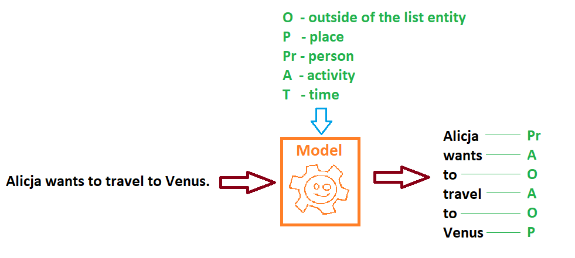

## Transformer and its use-cases.

Transformer - type of neural network’s architecture that consists of encoder-decoder substructure implementing attention mechanism. Mainly used in solving NLP (Natural Language Processing) tasks.

Exemplary architecture (based on [“Attention Is All You Need”](https://arxiv.org/abs/1706.03762))


 

This architecture might be utilized in problems that require grasping the meaning of natural language in the form of single words as well as full sentences, such as:

- **Sequence Classification**, i.e. Sentiment Analysis:


- **Extractive Question Answering** - finding answers based on previously delivered information:


- **Language Modeling**

  - Masked Language Modeling - filling gaps in the text:


   - Causal Language Modeling - adding single word at the end of sentence:


- **Text Generation** - generating new text based on provided base-text:


- **Named Entity Recognition** - assigning an entity to each word in a sentence, based on previously defined set of entities:





- **Summarization** - describing long piece of text in a simpler form:


- **Translation** - translating one language into another:


## HuggingFace Repository

Currently one of the most popular libraries that provides both pretrained Transformers & multitude of NLP processing functions is [HuggingFace](https://huggingface.co/models).

	

In the piece of code shown below we can see how simple and intuitive is its interface:


```python:
from transformers import pipeline

# 1. Translate text from polish into english.
model_checkpoint = "Helsinki-NLP/opus-mt-pl-en"
translator = pipeline("translation", model=model_checkpoint)
translated_text = translator("Wszyscy lubią dinozaury, ponieważ")
print(translated_text)
# Console output:
#  [{'translation_text': 'Everyone likes dinosaurs because'}]


# 2. Generate additional text complementing base-text.
text_generator = pipeline("text-generation", model='gpt2')
generated_text = text_generator(translated_text[0]['translation_text'], max_length=8, do_sample=False)
print(generated_text)
# Console output:
#  [{'generated_text': "Everyone likes dinosaurs because they're so big"}]


# 3. Perform Sentiment Analysis on generated sentence.
sentiment_analyzer = pipeline("sentiment-analysis", model='distilbert-base-uncased-finetuned-sst-2-english')
sentiment = sentiment_analyzer(generated_text[0]['generated_text'])
print(sentiment)
# Console output:
#  [{'label': 'POSITIVE', 'score': 0.9986183643341064}]
```


## Sign Language Transformer.

Due to widespread use of Transformer architecture in various language tasks, HearAI team decided to make use of it in the project of Sign Language words recognition.

It must be noted that input data in this type of problem is slightly different as compared to usual NLP tasks. Namely, it consists of video frames which present people singing words with their hands & body.

Therefore sentence’s context must be detected from information provided by consecutive RGB frames. Tokenization step is omitted in such a pipeline.

However datapoint’s character makes it possible to use different input modalities, such as information on joint location in the space of signing person. Thus placement of the arms, hands, fingers in all 3 axis XYZ are being fed into Transformer.

As in the first step of the project we would like to detect words (aka glosses), we used only Encoder part of the architecture developed in the paper: ["Sign Language Transformers: Joint End-to-end Sign Language Recognition and Translation", 2020, N.C. Camgoz, O. Koller, et al.](https://arxiv.org/pdf/2003.13830.pdf)

Below we can see the entire architecture proposed by the authors.


## Summary

Due to its extensive and universal structure Transformer is being successfully applied in many different tasks requiring understanding of human language. As it was presented earlier, it might be also applied to different input modalities, leveraging it’s context-detection powers to understand sign language from video datapoints, as long as images are being fed in the proper order (image at time t+1 follows image from time t)

Additionally, ease of use of Transformers, due to existing repositories with pretrained models, encourages using them in well known NLP problems as well as extending their applicability to new areas where attention mechanism encapsulated within encoder-decoder structure might be utilized! :D

## Sources

**Publications:**

 - "Attention is All You Need." 2017, Vaswani A., Shazeer N. et al.

 - "Sign Language Transformers: Joint End-to-end Sign Language Recognition and Translation", 2020, N.C. Camgoz, O. Koller, et al.

**Details on Transformers’ architecture:**

	- https://machinelearningmastery.com/the-transformer-model/

	- http://jalammar.github.io/illustrated-transformer/

**Transformers repository:**

	- https://huggingface.co/
