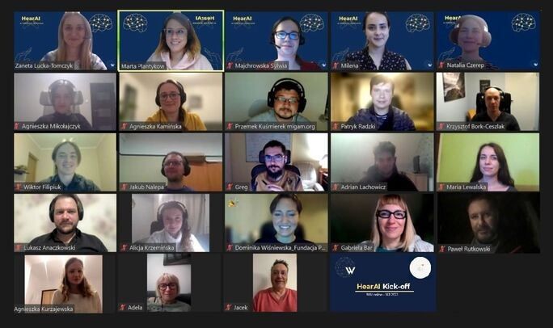

## Hear AI project has just started!
In the beginning, we would like to announce that the HearAI recruitment process has been closed. Organizers received 75 excellent applications, from which seven were finally selected.

### Ultimately the project is created by:
**Organizers**: people responsible for the elementary organizational aspects 
**ML researchers**: technical people familiar with machine learning 
**Team members**: people who support the project in non-technical areas 
**Mentors**: a group of people with a tremendous technical background who will help ML researchers overcome technical challenges 
**Speakers**: people who share their knowledge during the conference organized to understand Sign Language basics and Deaf people needs 
**Partners**: Companies that support the team in creating the right solution using the best hardware 
After creating a list of attendees, it was time to kick off the project. 

On November 16th, organizers, recruited volunteers, mentors, team members, and partners met together for the first time to launch a project and start working on HearAI challenges officially.
The meeting was divided into four main parts.  

See everyone involved.

 

The first one was a brief overview of the fundamental organizational aspects. To make sure we were on the same page, we defined the purposes and motivations of the project. We agreed that our primary goal is to **extend existing knowledge and public awareness**. 

After that, we introduced technical details and assumptions. The general idea is to recognize hand and body pose estimation and train AI models to convert them to HamNoSys. Such a model will let us receive the HamNoSys sequence as the output, which may later be used for literal translation (our first goal) and semantic translation. 

Then we took an opportunity to get to know each other better. Everyone – mentors, volunteers, and sponsors - were asked to introduce themselves. We found this part incredibly important as we realized how much power we have together. 

The last part was dedicated to a discussion about questions, concerns, and thoughts. At the end of the meeting, we became one motivated team that started a fantastic journey. 
**We hope to share results soon!** 
