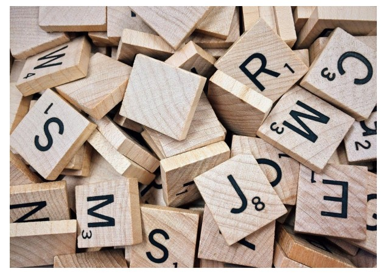

### What a great weekend we had… 

**On November 20th and 21st we had an opportunity to listen a few expert talks.**
It was a great chance to explore the topic of sign language, the Deaf Culture and problems concerning sign language translations.  
It is crucial knowledge at the beginning of this project as diving deep into the problem enables good understanding of challenges.  

### I speach 

On November 20th we had the pleasure to listen to **Agnieszka Kamińska**, one of our organizers who introduced us into the subject of the cerebral basis of sign language. 
The brain activity is usually studied using Magnetic Resonance Imaging (MRI) that enables observation of regions of activation during a given task (see figure 1).  
It appears, that brain activity during communicating the same information is very similar in both sign and phonic language.  
However, there is a visible difference between gestures and signs of sign language.  

![Figure 1 Brain activation during language production of bilinguals and monolinguals considering moves. [1]](figure1.jpg)

Figure 1 Brain activation during language production of bilinguals and monolinguals considering moves.[1]

 

### II speach 

The next day was even more exciting as we had more presentations. 
First one was delivered by **Justyna Kotowicz** and referred to the Sign language and cognitive processes of D/deaf people.  
An important issue that was mentioned was the children growth. As proved by research, children need communication for a proper cognitive process. 
However, the type of communication isn’t so important, as it was already said – in terms of brain activation, sign language is just as any other language. 
Deaf children thrive similarly to hearing children as long as they understand and are understood by others.  
That is why, Deaf children of hearing parents most often have problems with the cognitive process, as the communication stream is restricted.   

Figure 2 The key is communication!

 

### III speach 

Just after this presentation, **Bencie Woll** told us a little about Sign language in the wild: linguistic, technological and cultural challenges. 
This presentation was extremely vital for us as it pointed out some problems and traps that we can fall into during the project. 
Main lesson was to consult with Deaf people on their needs and expectations, not only do what we think is needed.  
She presented the challenges regarding the signs recognition, as there is also a spatial movement involved.  
Another important issue were existing solutions and their drawbacks.  

For example, during showing the sign, the face expression is crucial, as you should look at the person’s face,  
not hands and many existing solutions don’t even consider mimicry.  
Another problem are complicated devices that Deaf people are supposed to wear – for them it’s simply uncomfortable. 
And the most important thing is to consider their needs – for instance the system with polish letter recognition is useless for them as these letters are from foreign language for them. 

### IV speach 

The last presentation was held by **Maria Lewalska**, our team member, who gave us an introductory lesson about sign language. 
She confronted us with commonly known myths about Deaf people and next explained the difference between Polish Sign Language (PJM) and Sign Language System (SJM).  

### And then was practice! 
![Figure 3 “Good morning” in polish sign language. [2]](figure3.jpg)

Figure 3 “Good morning” in polish sign language.[2]

 

We have even learnt the song in sign language! We strongly encourage you to see a few songs in sign language as they are very expressive.  

At the end Maria has interviewed **Wiktoria Choręziak**, a very inspiring young woman, who in spite of being deaf achieves great successes.  
You can see the transcription of this interview in our next post 😊  

### The whole event was translated into sign language. Soon we will upload recording from the event. Stay tuned!

Sources: 

[1] Horwitz, B., Amunts, K., Bhattacharyya, R., Patkin, D., Jeffries, K., Zilles, K., & Braun, A. R. (2003). Activation of Broca’s area during the production of spoken and signed language: a combined cytoarchitectonic mapping and PET analysis. Neuropsychologia, 41(14), 1868–1876. doi:10.1016/s0028-3932(03)00125-8  

[2] Brainly.pl (hyperlink: osoby niesłyszace porozumiewaja sie za pomoca jezyka migowego . polega on na stosowaniu gestow i - Brainly.pl|) 
