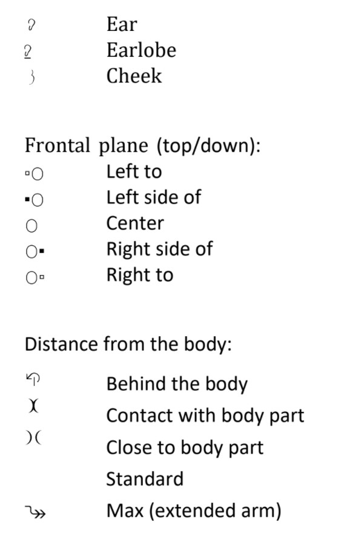

## HamNoSys – Introduction

As you can read on Wikipedia, Hamburg Sign Language Notation System is a gesture transcription alphabetic system that can be applied on an international level, so it works for all Sign Languages. It describes the symbols and gesture aspects such as hand shape, hand location and movement. Since it was developed (University of Hamburg, 1985) three versions were published – meaning the 4th version currently in force. 

### Representing Sign Language

Gesture description in HamNoSys has a well-defined structure. It can be divided into blocks that are presented in the picture below. Two out of six parts of the description are optional, the other 4 blocks are mandatory. Each block consists of symbols represented in a font that can be downloaded using [THIS](https://www.sign-lang.uni-hamburg.de/hamnosys/hamnosys_4_1_7.zip) link. 

Hand shape, Hand position and Movement refers to the initial position for a given sign. 

Let’s analyze all of the blocks:

***Symmetry operator***– It is optional, since it is used only for Two-handed Signs. It determines how the shape of a dominant hand differs from non-dominant hand. Do not worry if you do not understand this pretty complicated explanation yet – we will go through some examples later.

***Non Manual Features (NMF)*** – It is optional, since only some of the words in sign language implement it.  The list of NMFs is limited to 12 symbols, that represents for example puffed or sucked in cheeks.

***Hand Shape*** – Usually, the description of a handshape is divided into three aspects: Base form, thumb position and bending. There are 12 possible base forms, 4 possible thumb positions and 6 possible bending types. 

In some of the cases the description of a handshape can also contain a description of deviations from a general description or intermediate forms. We will analyze them in the following examples. A great example of possible cases can be found [HERE](https://www.sign-lang.uni-hamburg.de/dgs-korpus/files/inhalt_pdf/HamNoSys_Handshapes.pdf).

***Hand Position/Orientation*** – Two components are used to describe it: Extended finger direction and palm orientation. First of them specifies two degrees of freedom, while the last one specifies a third degree of freedom. Extended finger direction can be specified in one of the three perspectives (signer’s, birds’ or from-the-right view), that can be differentiated by the usage of a reference line (no, horizontal or vertical reference line). Palm orientation is defined relative to the extended finger direction.

Subscript can be used to make hand orientation relative to the movement. 

***Hand Location*** – is split into 2 components. First of them specifies x and y coordinates (top/down; right/left), second one (that is skipped if natural) specifies coordinate z (distance from the body). 

For two-handed signs the location may also describe the relation of two hands to each other.

***Movement/Action*** – represents a combination of path movements, that can be specified as targeted/absolute (location) or relative (direction and size) movements. For the purpose of the introduction only example movements are presented in a table below.
More detailed description will be presented in next post.

For all movement components  a diacritic symbol that specifies size, movement mode, number of repetition actions can be added. 

When there is more than one movement sign it can be written in one of two forms:
* More concatenation of actions – sequential performance
* Square brackets – done in parallel

For two handed actions it is possible to specify different actions for each of the hands.

### Let’s analyze some one handed examples!
*Example - Good* 
Let’s start with a pretty simple example – word “dobrze” (ang. good) from a Polish Sign Language is presented on a picture below (initial and final form). According to Polish Sign Language Dictionary (org. Korpusowy Słownik Polskiego Języka Migowego) its HamNoSys version has a following form:

 

Each of the symbols used in the HamNoSys description fits into the beforementioned blocks as following:

As you can see, in the initial form 1st and 2nd fingers are pinched, the extension finger is directed up, and the whole sign starts from the cheek. The movement is directed down and to the front (from the right view).

***Example - Have***
Another simple example: Word “mieć” (ang. have/possess) in Polish Sign Language. In this case, only one frame is presented since the sign initial and final form is the same. 

 
As presented on a video frame, hand is flat, thumb is out, extension finger is directed left, hand is placed on a chest, so the distance is described as a contact with the body. There is no movement.
    
    
***Example – Morning***
Word “rano” (ang. Morning) is presented below together with it’s Hamnosys description.
 

Initially fingers are pinched, extension finger is directed up, thumb is directed down-left, hand touches the cheek. Initially the hand has contact with the body (cheek). In movement the initial shape is replaced to finger 2, thumb out.

***Example – car:***
Aforementioned examples are quite simple. To dive deeper into Hamnosys, let’s analyze word “samochód” (ang. car). This time it is necessary to present more than 2 frames out of a video.
   
HamNoSys description:

This time the hamnosys symbol is described using a symmetry operator that indicates *up/down symmetry* of a movement. In initial form both hands are fisted with thumb crossed. Dominant hand extension finger is directed up-left, with a palm directed left. Nondominant hand extension finger is directed up-right, with a palm directed right. Frontal pane symbol is not used. Movement is described as going down (since dominant hand is going down) repeated once.

**Pictures and HamNoSys translation:**
*Joanna Łacheta, Małgorzata Czajkowska-Kisil, Jadwiga Linde-Usiekniewicz, Paweł Rutkowski (red.), 2016, Korpusowy słownik polskiego języka migowego, Warszawa: Wydział Polonistyki Uniwersytetu Warszawskiego, ISBN: 978-83-64111-49-5 (publikacja online)*.

