## HamNoSys 102
In the previous post, we’ve presented some basics of this gesture transcription system, along with examples. This time, we will dive deeper into some of the details! This post will focus on symmetry operators, hand shape, hand position, and hand location. We’ll soon analyze shape movement and non-manual features in a separate post, so stay tuned!
### One and two-handed signs
Before diving deep into details, we have to make one thing clear: There are two groups of sign language signs: One-handed and two-handed signs. Two-handed sign notation can be easily distinguished from one-handed. It always starts from the symmetry operator (when both hands are moving when signing) or contains a bracket containing the description of the difference in handshape (when only the dominant hand is moving when signing).

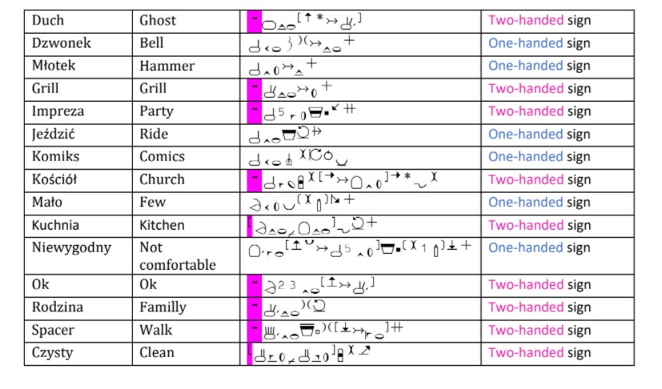

Following pictures present signs from the table:

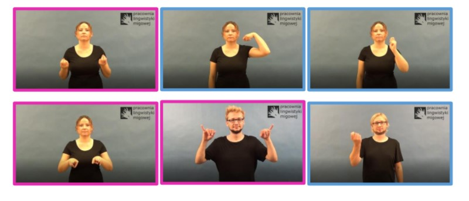

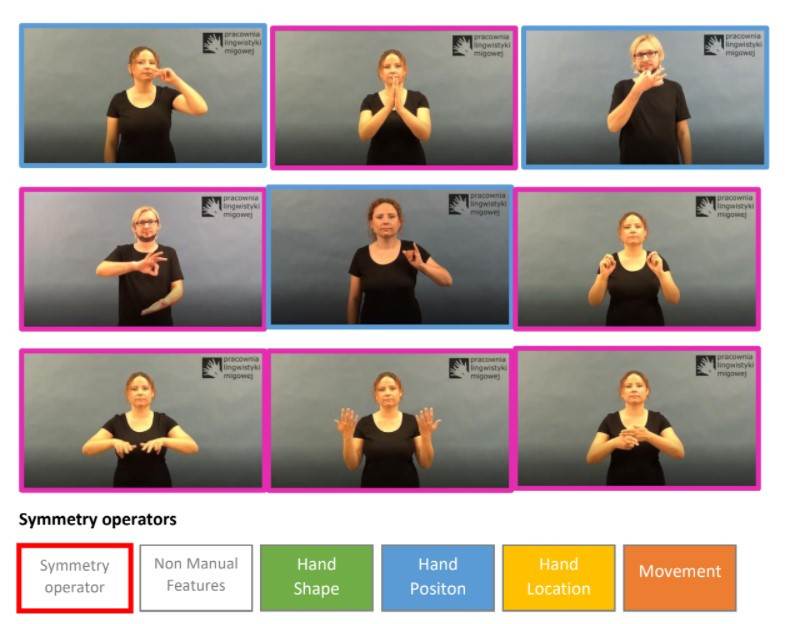

This part of the HamNoSys description applies only to two-handed movements and determines the difference between dominant and non-dominant hands. There are eight possible symmetry operators:

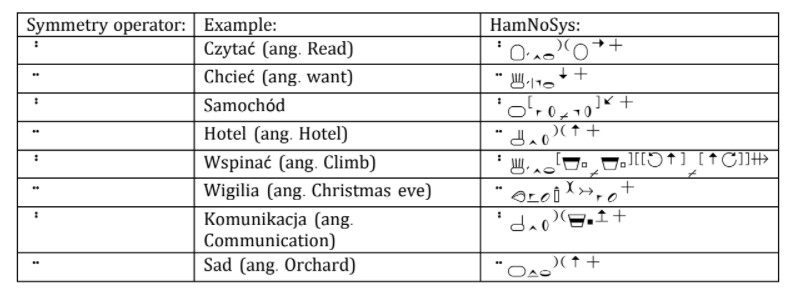

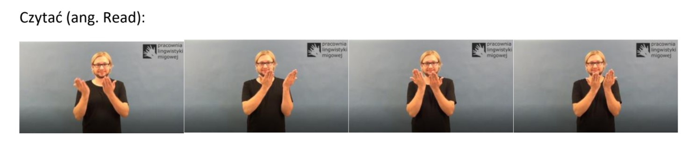

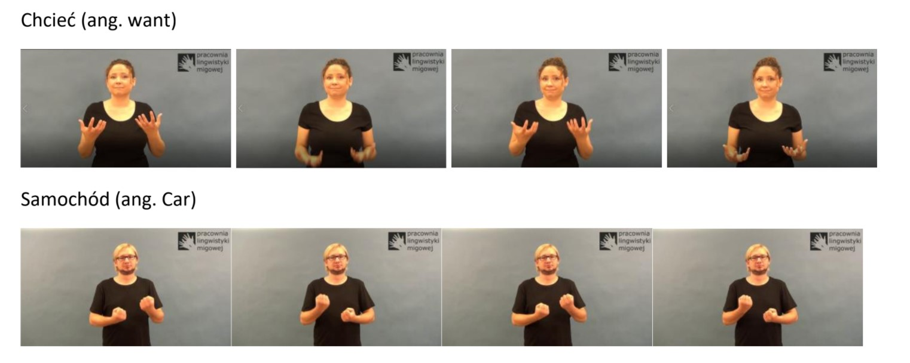

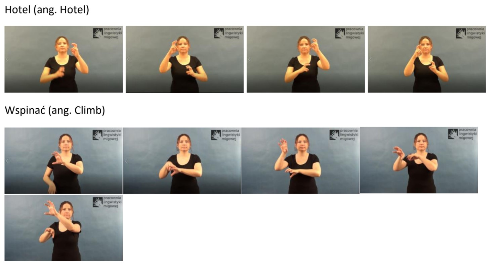

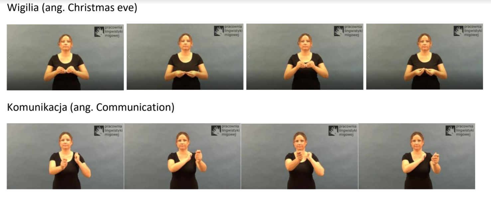

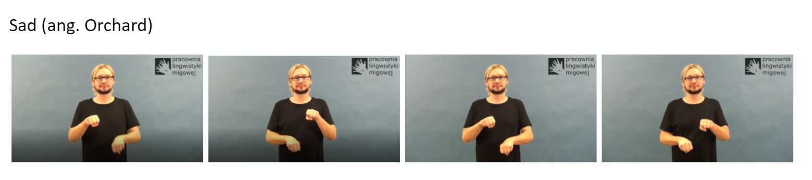

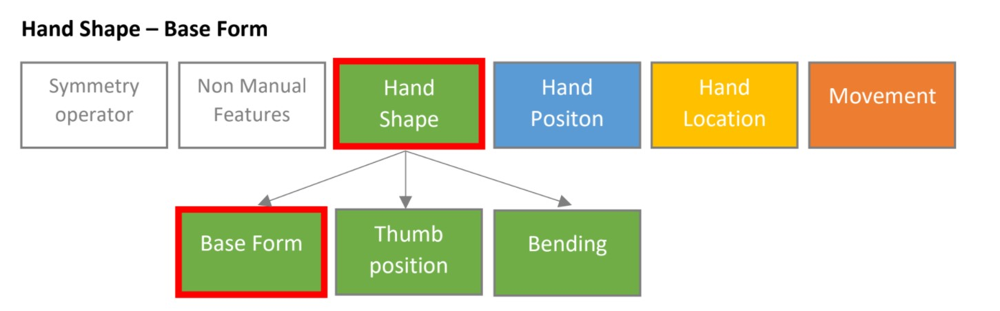

All hand shape base forms can be divided into open handshapes and thumb combinations. Each of those groups consists of 6 shapes, as shown in the table below:

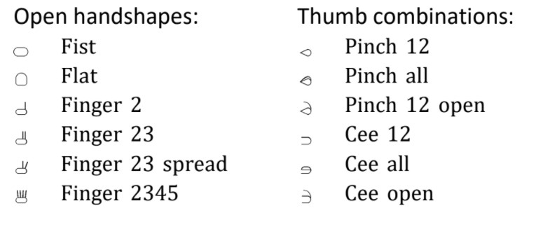

Handshape base form can be modified in two ways: overriding defaults or defining finger parts. 
Overrating defaults for both open handshapes and thumb combinations is performed using a set of numbers from 1 to 5, where each of the numbers stands for a particular finger. The picture below represents fingers’ names along with assigned numbers.

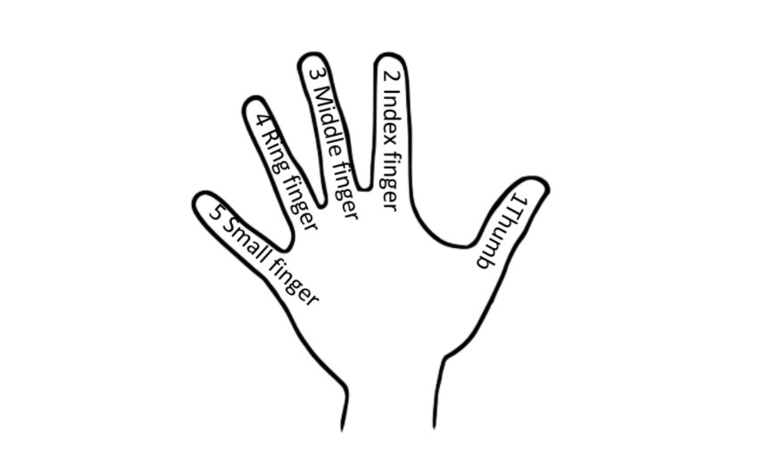

In default form, when  (finger 2) is used, the second finger (meaning index finger) is pointing out. This form can be modified using numbers, which means that the small finger is pointing out. For example, we can use words jeden (ang. One) and obcy (ang. Foreigner) presented in pictures below.

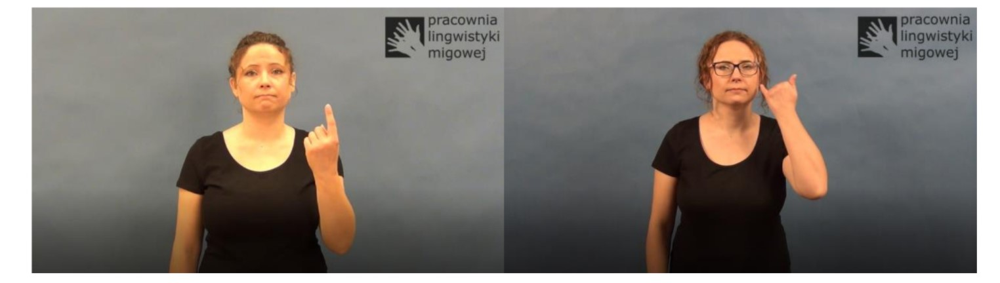

In the case of  (finger 23) in default form, the second and the third finger are pointing out. This handshape can be modified by overwriting both finger numbers. For example,  it means that the index finger and small finger are straightened. Example words are presented below, words żaba (ang. Frog) and samolot (ang. Plane).

In the case of thumb combinations, an additional number specifies selected fingers. For example, the shape  stands for index finger pinched with the thumb. If the shape  is used, then the index finger and the middle finger are pinched. The first two pictures below represent  (original and zoomed), the other two means  (actual and zoomed).

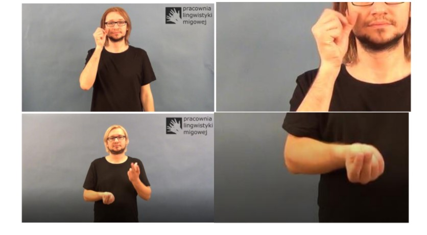

Defining finger parts introduces a new set of symbols that are described below:

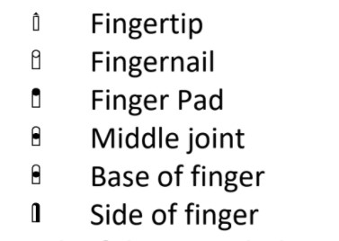

Each of those symbols can be used to modify the handshape (its base form) if combined with the previously introduced finger numbers. The number is written just after a handshape may indicate a lower finger number. After that, a symbol defining the point of contact and upper finger number must be used. A frame from a video of a man signing the word rodzice (ang. parents) described as  is presented in a picture below.

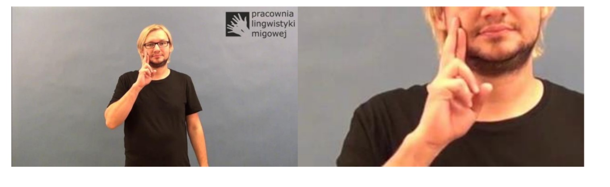

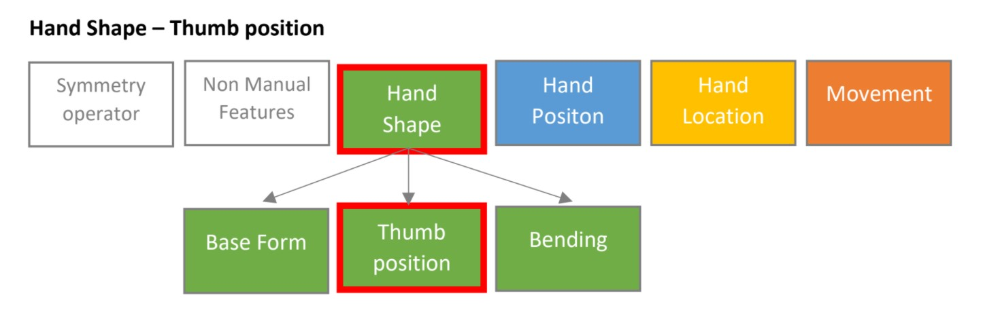

In our previous post, we introduced four possible thumb positions. This aspect of a sign can be modified for all of the thumb combinations form.
For one of the hand base forms -  (fist), the thumb position may take more forms, since the thumb may be placed in between fingers or hidden. In such a case, the additional operator  is used along with finger numbers to describe the thumb position. All possible cases are described below:

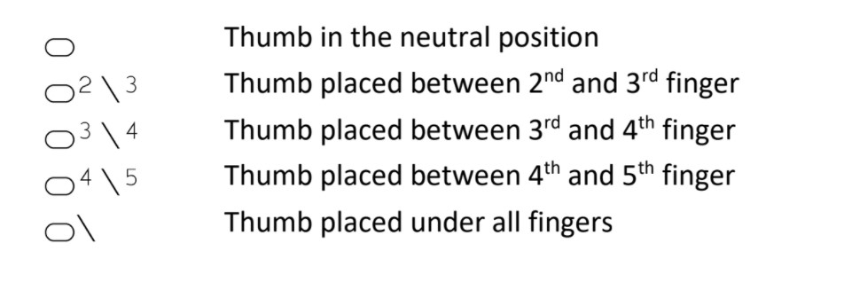

Since this particular sign is hard to find in our examples, let’s use a fist () and fig signs () from Wikipedia. 

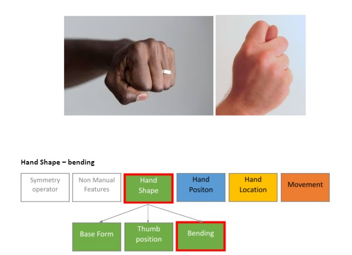

Bending can apply not only to a whole hand but also to a particular finger. In such a case additional bending operator is used along with the finger number. We can use  as an example:

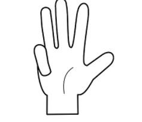

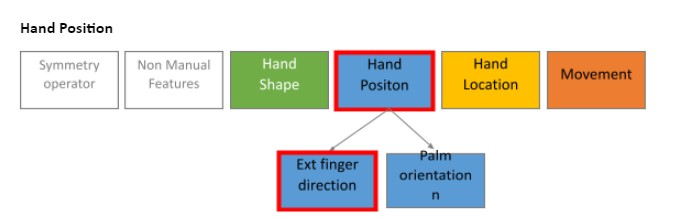

There are three groups of possible extended finger directions, each of them is specified in one of the three perspectives: signer’s view, birds’ view, or from-the-right view. The following table contains all possible cases:

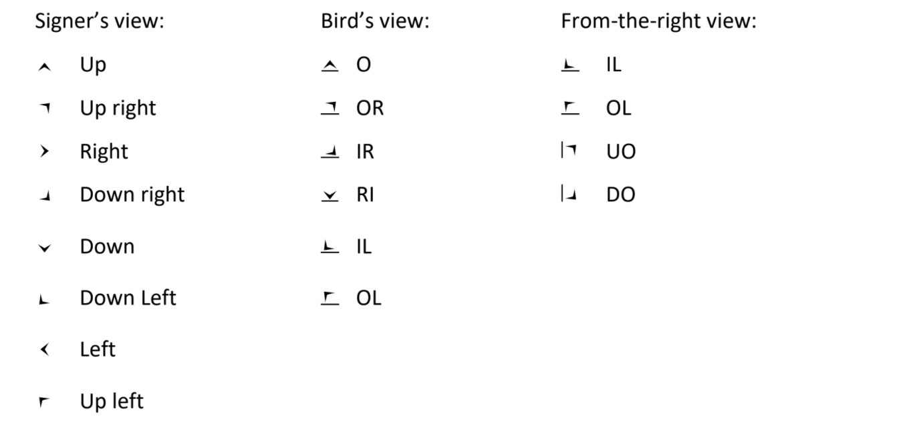

In some cases, extended finger direction is described using two symbols instead of one (secondary directions are used). In those cases the first symbol must belong to the From-the-right view group, and the other one describes the position in a bird’s view. You can find a great explanation of each possible case in the table below:

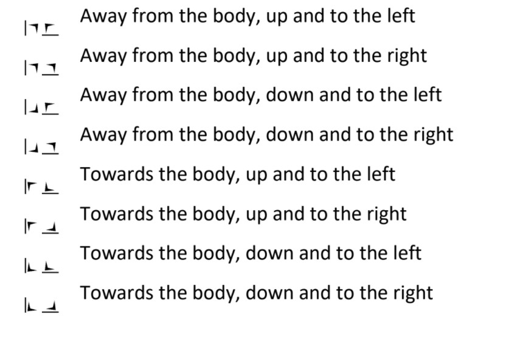

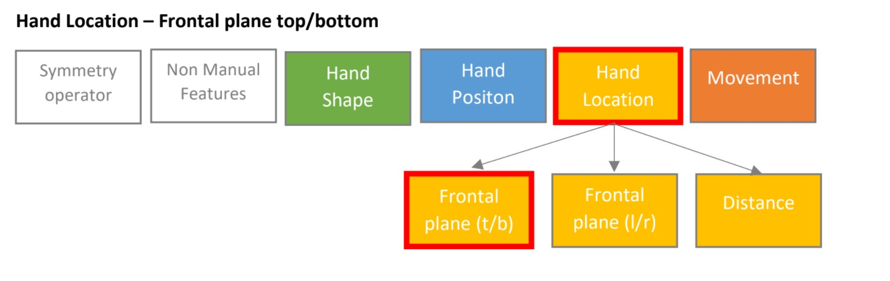

Some of the frontal plane symbols used to determine the hand location can be extended using the upper and lower operator. It is not possible to present this symbol by itself, so it will be presented when applied to the mouth and eyes symbol for the purpose of an example. See the example with the explanation:

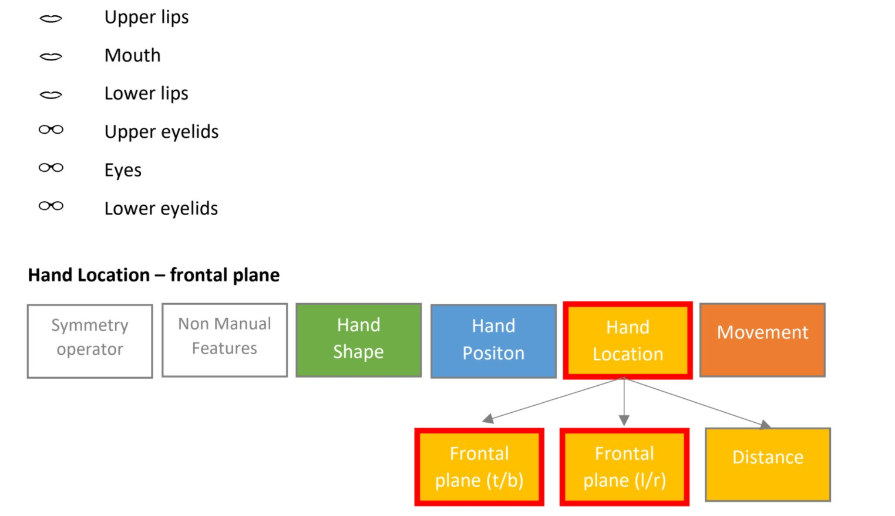

Only 21 frontal plane top/bottom options were introduced in the previous post since those symbols are frequently used. HamNoSys is prepared to support rarely used locations and their combinations. It supports head and trunk areas and upper arm, lower arm, and lower extremities. All of them are presented in the tables below, along with all frontal plane left-right options since they differ. 

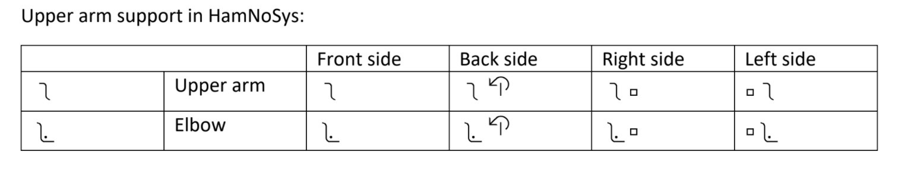

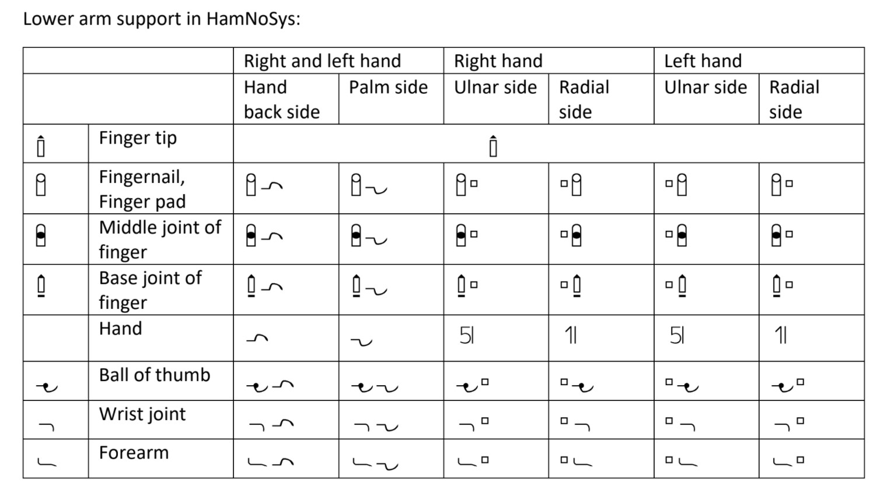

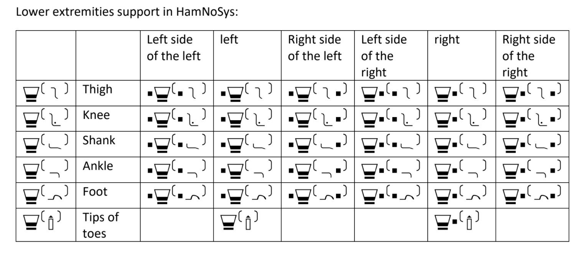

If a more precise position is needed, a combination of two neighboring regions combination can be used.

### Summary
In this post, you’ve dived much deeper into the details of HamNoSys. Now, you should understand the description of a more complicated initial position of signs. We can’t wait to introduce movements in the next post!

***The primary source of knowledge:*** HamNoSys – Hamburg Notation System for Sign Languages, Thomas Hanke, Universität Hamburg, thomas.hanke@uni-hamburg.de
***Pictures and HamNoSys translation:*** Joanna Łacheta, Małgorzata Czajkowska-Kisil, Jadwiga Linde-Usiekniewicz, Paweł Rutkowski (red.), 2016, Korpusowy słownik polskiego języka migowego, Warszawa: Wydział Polonistyki Uniwersytetu Warszawskiego, ISBN: 978-83-64111-49-5 (publikacja online).

