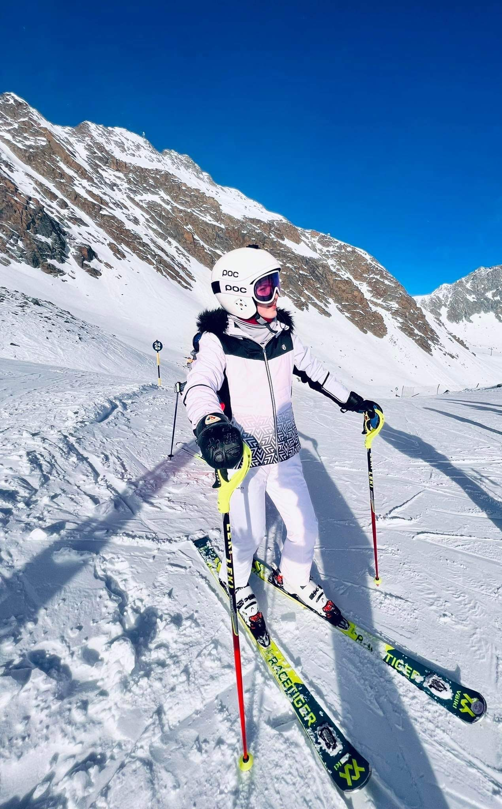
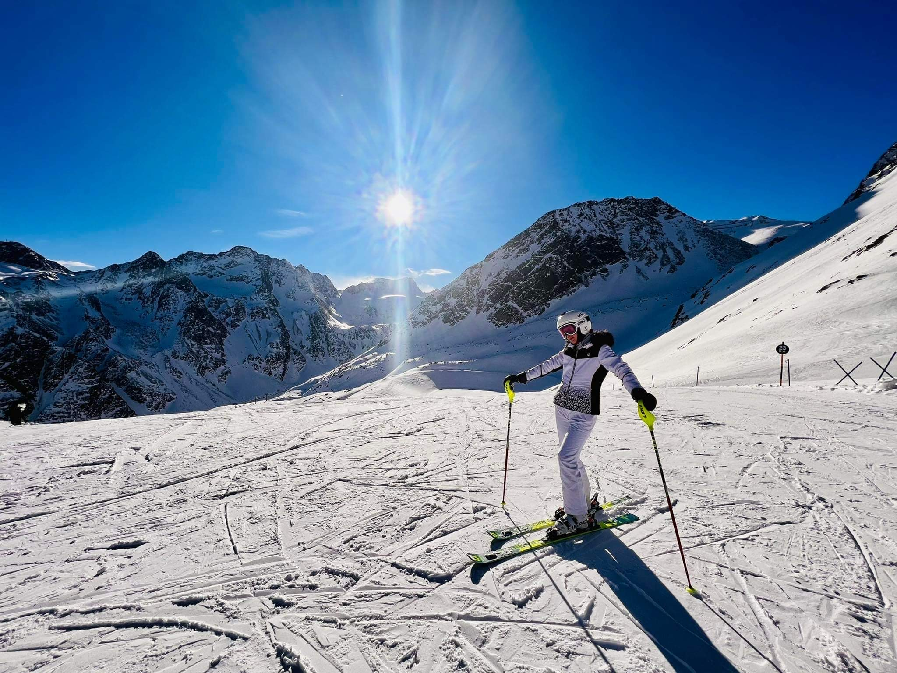
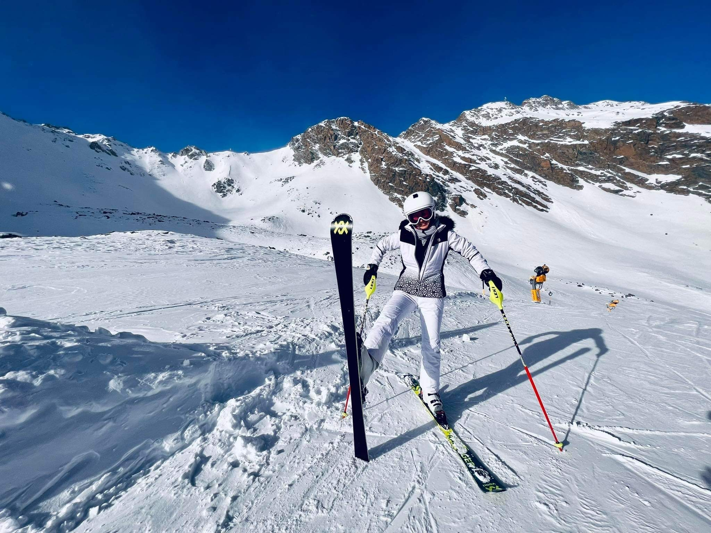

***[Przeczytaj wywiad w języku polskim]()***

## Interview with Wiktoria Choręziak 

### Translator: Magdalena Dąbrowska 

### Interviewer: Maria Lewalska 

One of our project main goals is to educate (ourseleves and hopefully others) about the Deaf, their culture, their language. On November 20th and 21st we had a pleasure to host HAI Virtual Event where our speakers shared their knowledge in topics related to sign language. (More about the event [here](https://www.hearai.pl/post/3-conference/)) The event ended with inspiring and informative talk with Wiktoria Choręziak, a 17-year-old girl who was born deaf. Wiktoria in the interview hosted by Maria Lewalska shared thoughts about being Deaf in a hearing world, her journey in speech therapy and her passions. 

***Maria Lewalska:*** Before we start the interview with you, it is worth saying that you are deaf but you communicate both in sign language and verbally. It was not an easy path for you, you worked with a speech therapist for many years and despite moments of doubt you managed to achieve your goals for which I admire you very much. You also have many interests; you are a representative of Poland in alpine skiing for the Deaf, but also a model and influencer. You are an incredibly inspiring person. How did the beginning of this road look like? Were you born deaf? Your family too? 

***Wiktoria Choręziak:*** I have been deaf since I was born, just like my parents and brother. My brother has a lesserer degree of loss, he also talks and signs, he’s doing great. 

***Maria Lewalska:*** And your friends? Are they mostly Deaf or Hearing? 

***WCh:*** Since I was a child, I went to a hearing school, from the first to the eighth grade. In the following years, I attended a high school for the deaf in Warsaw. I live in the world of the hearing and the deaf. I have more hearing friends, because I entered the world of the Deaf quite recently.  I am becoming more familiar with it slowly and systematically. I feel great with both hearing and deaf people. 

***ML:*** During your journey, did you sometimes think that the lack of hearing or its limitations was a disadvantage? 

***WCh:*** For me it is not a defect, I can speak, I can write. These are not limitations; however, the period of the coronavirus has caused some difficulties. Now people are wearing face masks. When I want to talk, I request others to take their  masks off, because for effective communication I need to see the whole face. There are people who are afraid to remove masks because of the possibility of getting infected, so we have to write instead, which is more difficult. When I have the ability to see my lips, communication is better and easier for me. 

  
***ML:*** I understand you well, because sometimes it is also difficult for me to understand someone with a mask on their face. How do you communicate with your surroundings? What form of communication do you prefer? 

***WCh:*** From birth, I communicated with hearing people; in class, and in therapy. On a daily basis, I spoke and signed only in the school for the deaf. There, the teachers also signed, and thanks to that I was able to learn easily and understand sign language. When I was attending a school for hearing people, it was only spoken and there were also issues, because teachers would turn around and I couldn’t see their mouths. It made me strain my eyes. I admit that it’s hard for me to compare. Honestly? Both speech and signing are in my life. These are my two worlds. 

***ML:*** Do the Deaf dance? I have often encountered this question. 

***WCh:*** That’s an interesting question. I am going to tell you about a situation that happened in Łódź. I took part in the casting for Miss. It has always been my dream to participate in such an event. During the elimination a member of the jury, asked me how I perceive sounds and music. She also asked how I manage with dancing. I had no problem reading written content. Even so, I failed to qualify. The jury was concerned that I would have a problem with dancing. 

***ML:*** Really? 

***WCh:*** Yes. It was an election for Miss (of the hearing) and therefore I was disqualified. I would like to add that from the first to the sixth grade of primary school I went to the theater and there were a lot of hearing people and I was the only one deaf. The ladies wondered how I could do it. And so, we tried, I walked around, I watched others, it was a very interesting period. I still remember it today! Thanks to this experience, I don’t give up and keep trying. I hope that someday I will be able to qualify for Miss. I want to show that I can do it despite the fact that I am deaf. 

***ML:*** I believe that you will succeed with your determination. We will keep our fingers crossed! Especially since the Deaf dance, they perform in plays and the lack of hearing should not be such an obstacle. Referring to the previous question; how do the deaf experience music? 

***WCh:*** It’s hard at first because people who cannot hear have to find their own, most convenient way and practice it. It is difficult for Deaf people, but they feel vibrations, and emotional messages. Once upon a time I was at a Polish Rock concert. The music was exceptional, I was shivering! I was wearing a special vest which made me perceive the vibrations of this music. 

***ML:*** Amazing! 

***WCh:*** Yes, it was very interesting, so emotional. 

***ML:*** I have not heard of such vests before. It’s interesting what you’re talking about. I also have a question that comes up frequently; can the deaf have a driving license? 

***WCh:*** Yes, deaf people can have a driving license. Many hearing people are surprised, but it’s true. Just as hearing people listen to their surroundings, the Deaf work more with their eyesight and are attentive. They have no problem with it and can learn it without problem. I myself plan to get a driving license in the near future. 

***ML:*** I will tell you Wiktoria that I am also going to get a driving license soon, so we can support each other. Tell me Wiktoria, do you think there is a high demand for specialists who use sign language? 

***WCh:*** Yes. There is a big problem in my class right now because everyone needs help. I am often asked to act as an interpreter, but I do not specialize in PJM (Polish Sign Language). The availability of interpreters is difficult, for example when someone wants to visit a psychologist or the police. It is necessary to use the PZG application, but it takes a long time. I believe that it would be better if, for example, I entered the office and had one in the translator’s place. 

***ML:*** Tell me what’s the hardest thing about being deaf? 

***WCh:*** I have not yet encountered such large barriers to talk about difficulties. Only during this period of the pandemic, wearing masks has caused some difficulties. Also the fact that I was denied the Miss contest because of being deaf. I  don’t have any major barriers on a daily basis. I am lucky to be able to speak. Growing up it was hard, I had to go to a speech therapist. I function in the hearing world thanks to my parents. 

***ML:*** And thanks to your hard work and determination. 

***WCh:*** Yes, that’s true. 

***ML:*** How are the deaf coping on the Polish labor market? 

***WCh:*** In Poland, the deaf have a hard time. My friend recently wanted to go to work, but she was refused because she is deaf. There is no health and safety regulation regarding the safety of deaf people. Deaf people can see, hearing people can communicate with them, transmit information. No problem. Some people are lucky to be able to talk a little and go to work. 

***ML:*** Exactly. Yes, now, a bit  of the other hand. Tell me what’s the best thing about being deaf? 

***WCh:*** Interesting question … What’s cool about being Deaf? When I’m asleep, I take off my hearing aids and it’s completely silent. People who hear when there are noises at night cannot sleep, and I do not have this problem. I am generally content to be deaf. This is my world. 

***ML:*** Tell me what would you change in the surrounding world to improve the situation of the Deaf? 

***WCh:*** I would like hearing people to respect the Deaf and have a greater awareness of our world. Learning Polish Sign Language by hearing people would be very helpful. It would also be a huge advantage if psychologists used PJM and there were more translators.I would like there to be applications for reading books, listening to music, receiving TV - everything - so that it would all be translated. 

***ML:*** I hope it will change soon. It is thanks to the fact that you have agreed to talk to us, to answer our questions, that awareness about the Deaf and their culture will increase. I believe the world will move in this direction. Thank you very much Wiktoria for the interview. Now feel free to discuss and ask questions. 

***Żaneta Łucka-Tomczyk:*** You really are a very inspiring person. We are glad that you could be with us today. I already have my own question, even two. I wanted to ask what technologies help you function on a daily basis, because I know that you joined us thanks to the messenger. What else are you using? You mentioned the PZG application, could you elaborate on it? 

***WCh:*** I haven’t actually used the PZG application. Sometimes I ask my hearing friends to call and speak for me. Thanks to verbal speech, I can gather more information and learn more. I have not used such applications yet. 

***Emilia:*** I’m a hearing person, I’m studying in Warsaw at the University of Warsaw. I am wondering about the topic of technology. What are the feelings of the Deaf, because in the future technology will develop. I wonder what are the opinions on the future of Deaf Culture in connection with the development of artificial intelligence? 

***WCh:*** Indeed, technology is advancing very fast. I hope that in the future, the lives of the Deaf will be better and easier: thanks to  advances in the world of technology that will overcome barriers. 

***Emilia:*** I wonder if sign language will disappear by creating new applications and computer programs? 

***WCh:*** People using these applications will be able to communicate and translate.  

***Emilia:*** I have one more question. You talked about rehabilitation when you were a child. Later when you grew up you went to a speech therapist, you also learned to read lips, talk … I wonder how you perceive other people when they congratulate you, admire you, say “wow, great!”. What do you feel then? 

***WCh:*** I feel chills. I am lucky that I went to a speech therapist as a child. It was hard for me, but it gave me great results - I can talk. I meet Deaf people whom I feel sorry for. They have braces?, they are going to go to a speech therapist  to learn to speak, but it is difficult for them. Not everyone has learned to speak. 

***Emilia:*** Yes, it is interesting because  this is thefirst time I’ve heard that a deaf person says that thanks to rehabilitation they feel better. Previously, my Deaf friends have said that rehabilitation was difficult, and a waste of time.  

***WCh:*** Yes, that’s true. 

***Emilia:*** Thank you. 

***Wiktor Filipiuk:*** When I was wondering how to ask this question, I was putting it together in my head as a series of words.  And in the case of a deaf person is it similar?How does it work? Does they think in signs? How is it for you, Wiktoria? 

***WCh:*** A bit of a tough question. I don’t quite know what’s going on. Can you reformulate the question? 

***Agnieszka Mikołajczyk:*** I can translate and say what Wiktor meant. The point is that we hearing people speak in our head with an inner speaking voice, in our heads. Wiktor asks if you speak sign language in your head. 

***WCh:*** Same as hearing. When I think about what I want to say, I think in words (sign language). 

***WF:*** Sure, thank you very much. 

***AM:*** It’s all amazingly interesting. Wiktoria, you are a very inspiring person and your outlook on the world, your openness make me full of admiration! Thank you for coming to us, for telling us about yourself, for sharing your experiences with us. This is just an introduction. I was very intrigued by what was mentioned about how you learned to speak. When I try to imagine that someone who cannot hear is learning to speak, it seems very difficult to me. How does it work? Are there any methods specifically designed for this? 

***WCh:*** Difficult question. There are methods for Deaf people, but I can’t explain it well. Just when I went to a speech therapist, you had special exercises for the Deaf, she clearly showed how she speaks.  

***AM:*** Yes, the topic seems to be very difficult. I am also curious, if there was such an application supporting  deaf people learning to speak, do you think that someone would use it? 

***WCh:*** I don’t know if that would help a lot. On the phone, yes, it’s nice, but in real lifeyou can correct someone. Learning to speak is better  in person because there are  various situations. There is no substitute for face-to-face contact with another person. Sometimes you can learn on the phone, but I doubt an app could teach you to talk. 

***AM:*** I understand. Thanks for the answer! I asked out of curiosity, because I used to learn Japanese myself and used an app too, and indeed, it’s not the same. I went to live lessons with a Japanese girl, and I also learned over the phone. Indeed, learning over the phone is not the same as live contact. I was wondering if it’s the same with sign language. Thank you! It was nice to meet you. 

***Justyna Kotowicz:*** Great interview, nice to meet you. I have a question that has been asked before, but I still wanted to ask; a question about exactly how technology could help you in life and what would be needed. We’ve talked about Google’s assistant before. It has a feature where I speak and I don’t have to type anything into Google,  it automatically searches for me. Do you think something like this would be useful? So you sign and Google searches for it . Instead of writing  which takes a long time, and is difficult. Maybe you have any other ideas? 

***WCh:*** This is a cool idea. I have heard from friends about a certain situation. Someone got a ticket from the police and showed that they did not hear. The policeman brought a tablet, spoke to him, and this tablet translated his speech into sign language. Thanks to this, communication with this Deaf person was efficient. Unfortunately, this is not enough, I would like it to be more widespread. It would be easier in real life for sure. 

***JK:*** So you think it would be useful? 

***WCh:*** Yes. 

***JK:*** There is also a kind of assistant that I say to my phone: “Set my alarm clock forseven in the morning.” I don’t have to enter it manually. Do you think it would be cool if she could sign for the phone and it would set the alarm clock for you. 

***WCh:*** I think it is a bit hard to do and not feasible. Of course, it would be more convenient in life. I wish there was something like this, but I don’t know if there is anyone who can come up with such a technology. 

***JK:*** I have a third question. Have you seen virtualavatars which sign? They are artificial, computer-made. Have you seen anything like this? 

***WCh:*** I’ve never seen anything like this before. 

***JK:*** I think it would be nice to show you so that you could judge how you perceive it. Do you like artificial, computer signing? I think it would be valuable - also for people who do something like this. 

***WCh:*** I understand. I would like to see and judge if that would be a good idea. 

***JK:*** Of course. Thank you very much! 

***Maria Ferlin:*** Does it matter which hand we make a sign with? 

***WCh:*** It depends on the situation; if my right hand is occupied, I use my left hand and vice versa. Generally, you can sign with both hands. 

***Agnieszka:*** What are the dynamics of speaking among Deaf people? For example, when they are very emotional, they want to show that they are angry; they sign much faster or use facial expressions that way. How are emotions expressed when signing? 

***WCh:*** Yes, of course there are emotions. We usually sign calmly. It also depends on one’s personality and the topic of the conversation. With stronger emotions, people sign faster. During an argument, these emotions are also more expressive and the signs are shown in a wide angle. 

***Agnieszka:*** Are there any gestures in signing? Are there any phrases that do not mean something specific, but a wave of the hand, or the phrase “Co nie?”. Or do all the gestures mean something? 

***Ż.Ł-T:*** Let me just add that in spoken language there are sometimes such interludes in the form of curses. Are there any in sign language? 

***WCh:*** Yes, they do happen in sign language too. There are curses, bad words. Just like in speech. 

***Ż.Ł-T:*** And the words that are just such interludes? For example, “Co nie?” Is what Agnieszka was talking about. 

***WCh:*** There is no “Co nie?”. More like a hand wave to get rid of something. 

***ML:*** Wiktoria, you are a person with many interests and passions. You play sports, specifically alpine skiing. How do you collaborate with your team? Tell me about skiing in general, I’m very curious. 

***WCh:*** From childhood I dreamed of learning to ski, go on trips, go to the club, train. Then the dream disappeared for a while. Everything started when I was in Ząb near Zakopane. I was there for winter holidays. When I rented the ski equipment, people realized that I was deaf. They said there was an instructor who was also deaf. He couldn’t sign, but he spoke and was a lip reader. We practiced together. I asked if there was a club that would accept me. He said there is such a club in Warsaw. Luckily, the next day a person from this club came and we trained together. This gentleman knew my instructor very well. He respected the deaf people very much, he took me to the club and I managed to go to Warsaw. I attended training and exercises. We went to the mountains and I trained there. Two years ago there was the Polish Skiing Championships for the Deaf. I didn’t know there was such a thing; then I was invited to the deaf staff. I go to training, it’s hard, but I don’t give up. In two years I will have an Olympics in Canada. I do not know if there will be snow in Poland, but recently I was abroad in Lithuania and trained there in a special training hall. Skiing is not my only passion. I also like taking photos, dancing, and I'm interested in modeling. I have an Instagram account where I show what I can do. I dream about joining Top Model. I would like to make the most of my life. I am deaf, but I would like to be where hearing people are and to show others what I’m capable of. Life is short and opportunities must be seized. I would like to do as much as possible! 

***Magdalena Dąbrowska:*** That gave me chills. 

***ML:*** Me too. It is not only the day when I learned a lot about the issues discussed at our conference. You yourself have taugh us about life through your attitude. Our obstacles are nothing compared to what you had to overcome and how much you have achieved. I’m impressed. 

***WCh:*** I wanted to say that I also have chills! I would like to thank everyone for this meeting. At first, I was a bit afraid of this conversation. I hope it gets better in the future. I hope to finally get to Miss. 

***Ż.Ł-T:*** Thank you very much, Wiktoria. Here in our chat, there is information that we will keep our fingers crossed for the medal and watch the Olympics in Canada. For Top Model as well. Good luck. If you want, you can share your Instagram link with us. Thank you for your cooperation. Wiktoria also supports us on various other topics related to our project. For example, we created a questionnaire for the deaf and we collaborated with Wictoria here. She will probably appear at our various meetings more than once. That’s all for my part. Thanks a lot to everyone. 

 We would like to to send a special thanks to Piotr Kawalec who helped us with the English translation and Magdalena Dąbrowska for being our Polish Sign Language translator.
